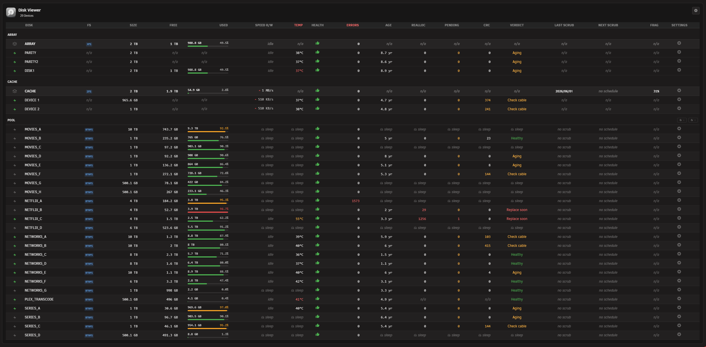

# Disk Viewer for Unraid

A compact dashboard widget that replaces Unraid's per-pool disk widgets with a single grid of all array, pool, and unassigned devices. Adds a full-page Tools view with detailed SMART, temperature, and capacity columns. Ideal for servers with many disks.

<p align="center">
  &nbsp;
  &nbsp;
  &nbsp;
  &nbsp;
  
</p>

## Features

- Dashboard Widget: Monitor every disk on your Unraid server in real time from the dashboard
- Tools Page: A full-page view under Tools > Disk Viewer with a wide table of every disk and detailed SMART, temperature, capacity, scrub, and health columns, with its own independent settings
- Section Organisation: Disks grouped under ARRAY, CACHE, POOLS, and UNASSIGNED with independent show/hide toggles
- At-a-Glance Stats: Capacity, free space, used percentage, temperature, current read/write speed, and SMART health per disk
- Drag-to-Resize: Footer handle to reveal more rows or shrink the widget back down without leaving the dashboard
- Manual Spin Control: Per-disk bolt button to spin a disk up or down on demand, with bulk controls at section headers. Array members and multi-disk pool members stay protected
- Spindown Aware: Does not wake sleeping disks just to read temperature or SMART, and keeps showing the last-known values while they sleep
- Header Bar Indicator: A compact disk badge in the WebGUI top bar with temperature, health, and utilization markers reflecting the worst current state, with a configurable click action
- Severity Highlighting: Used percentage and temperature shift to warning or critical colours, either inheriting Unraid's native Display thresholds or using your own
- Auto Refresh: Configurable polling interval for live disk state, set separately for the widget and the tool
- Theme-Aware: Inherits the active Unraid theme (black, white, azure, gray) without override hacks
- Mobile Responsive: Works on all screen sizes including the Unraid 7.2+ responsive WebGUI
- Persistent SMART Cache: Last-known SMART values are stored on the flash config so they survive reboots and plugin updates
- Settings Page: Standalone settings at Settings > Disk Viewer, with per-tab Apply and Reset and browser-native form submission

**Dashboard Widget Screenshot**


**Tool page Screenshot**



## Requirements

- Unraid 7.2.0 or later (the widget uses the responsive tile registration API). Earlier versions render a legacy fallback.
- Optional: the **Unassigned Devices** plugin, if you want unassigned devices to appear.

## Installation

**Via Community Applications (recommended)**
1. Open Community Applications in Unraid
2. Search for Disk Viewer
3. Click Install

**Manual Installation**
1. Go to Plugins in Unraid
2. Click Install Plugin
3. Paste the following URL and click Install:
   ```
   https://raw.githubusercontent.com/Lazaros-Chalkidis/unraid-diskviewer/main/diskviewer.plg
   ```

After installing, open the dashboard. You can hide the default per-pool disk widgets from the dashboard layout editor. The full table lives under Tools > Disk Viewer.

## Settings

**Settings > Disk Viewer** has two tabs, **Widget** and **Tool**, each with its own independent options and its own Apply and Reset buttons. Applying or resetting one tab never affects the other.

**Behavior**
- Automatic refresh on or off
- Refresh interval in seconds (widget default 20, tool default 10)
- Drag step size in rows, widget only (default 1)
- Allow spin actions: makes the bolt clickable on single-disk pool and unassigned devices. Array members and multi-disk pool members are always protected

**Display**
- Show array, RAID groups, pool, and unassigned sections, each toggled independently
- Header bar indicator on or off, with a click action (Open Main, Open Dashboard, or Open Settings)
- Highlight pool disks by used percentage (widget only)
- Show filesystem badge, disk errors, and section indicators (widget only)
- Show used column and Decimal in used percentage (both on by default)
- Font size (default or small)
- Space severity highlighting: Inherit (use Unraid's native Display thresholds), Custom (your own warning and critical percentages, defaults 70 and 90), or Disabled

Temperature warning and critical thresholds are read from Unraid's native Display settings.

**Settings Page**


**Header Badge**


## How it works

Disk Viewer reads `/var/local/emhttp/disks.ini` (Unraid's live disk state) and `/boot/config/pools/*.cfg` to classify each device into array, cache or another multi-disk pool, single-disk pool, or unassigned. Unassigned devices are read from the Unassigned Devices plugin's ini when that plugin is installed.

The widget and the tool poll the backend at their configured intervals. The backend writes a small runtime cache under `/tmp/diskviewer_cache/` that the header bar badge reads on its own schedule, so the header icon stays responsive without the widget being open. Last-known SMART attributes are cached under `/boot/config/plugins/diskviewer/` so they persist across reboots and plugin updates, keeping the SMART columns populated even while disks are asleep.

## Development

### Requirements
- Unraid 7.2.0 or later (for testing)
- Bash (for the build script)

### Build
```bash
./build.sh                  # release build
./build.sh "" dev           # dev build
./build.sh "" local         # local build (embeds .txz in .plg)
```

### Project structure

```
unraid-diskviewer/
├── source/
│   ├── css/
│   │   ├── widget.css
│   │   ├── tool.css
│   │   └── settings.css
│   ├── js/
│   │   ├── diskviewer.js
│   │   ├── diskviewer-tool.js
│   │   └── diskviewer-header.js
│   ├── include/
│   │   ├── diskviewer_api.php
│   │   └── diskviewer_header.php
│   ├── img/
│   │   ├── diskviewer.png
│   │   └── diskviewerplugin.png
│   ├── icons/
│   │   └── hdd.svg
│   ├── event/
│   │   ├── started
│   │   └── stopped
│   ├── scripts/
│   │   └── merge_cfg.sh
│   ├── DiskViewer.page
│   ├── DiskViewerTool.page
│   ├── DiskViewerButton.page
│   └── DiskViewerSettings.page
├── screenshots/
├── build.sh
├── CHANGELOG.md
├── ca_profile.xml
├── diskviewer.xml
└── README.md
```

## Issues and support

- GitHub Issues: https://github.com/Lazaros-Chalkidis/unraid-diskviewer/issues
- Unraid Forum: https://forums.unraid.net/topic/198667-plugin-disk-viewer/

## Author

**Lazaros Chalkidis** - https://github.com/Lazaros-Chalkidis

## License

Copyright (C) 2026 Disk Viewer Unraid Plugin - Lazaros Chalkidis

Licensed under the GNU General Public License v3.0 or later (GPL-3.0-or-later). See the `LICENSE` file for the full text.
