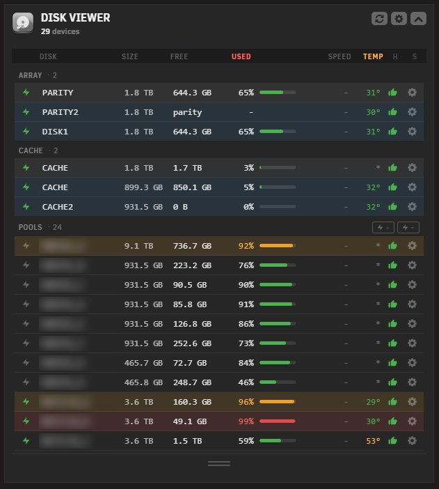
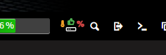
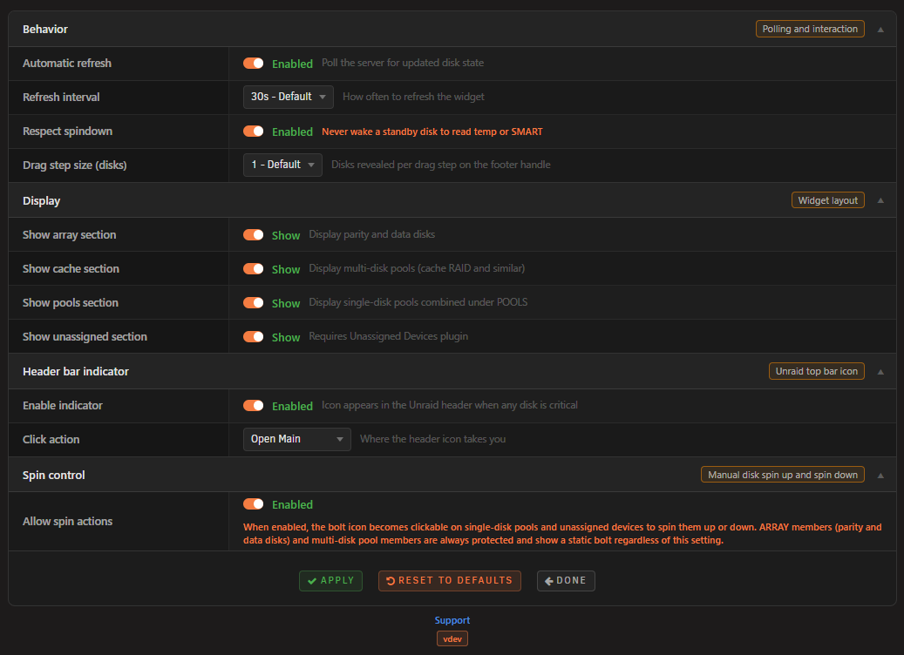

# Disk Viewer for Unraid

A compact dashboard widget that replaces Unraid's default per-pool disk widgets with a single, scannable grid showing all array disks, pool disks, and unassigned devices. Designed for servers with many disks where the stock widgets consume too much screen space.

<p align="center">
  &nbsp;
  &nbsp;
  &nbsp;
  &nbsp;
  
</p>

## Features

- Dashboard Widget: Monitor every disk on your Unraid server in real-time from the dashboard
- Section Organisation: Disks grouped under ARRAY, CACHE, POOLS, and UNASSIGNED with independent show/hide toggles
- At-a-Glance Stats: Capacity, free space, used percentage, temperature, current read/write speed, and SMART health per disk
- Drag-to-Resize: Footer handle to reveal more rows or shrink the widget back down without leaving the dashboard
- Manual Spin Control: Per-disk bolt button to spin up or spin down on demand, with bulk controls at section headers for groups
- Spindown Respect: Skips waking disks to read temperature or SMART when they are asleep, configurable
- Header Bar Indicator: Thumb-up icon in the WebGUI top bar showing worst current state across all disks, click-action configurable
- Severity Highlighting: Used percentage and temperature colour-shift to warning or critical based on Unraid's native Display thresholds
- Auto Refresh: Configurable polling interval from 5 to 300 seconds for live disk state updates
- Theme-Aware: Inherits the active Unraid theme (black, white, azure, gray) without override hacks
- Mobile Responsive: Works on all screen sizes including the Unraid 7.2+ responsive WebGUI
- Performance Friendly: Per-request memoisation, request-frame-throttled drag, CSS containment on the tile, lightweight polling
- Settings Page: Standalone settings at Settings > Disk Viewer Settings with browser-native form submission for instant Apply

## Requirements

- Unraid 7.2.0 or later (the widget uses the responsive tile registration API). Earlier versions render a legacy fallback.
- Optional: the **Unassigned Devices** plugin, if you want unassigned devices to appear in the widget.

**Via Community Applications (recommended)**
1. Open Community Applications in Unraid
2. Search for Disk Viewer
3. Click Install

**Manual Installation**
1. Go to Plugins in Unraid
2. Click Install Plugin
3. Paste the following URL:
   ```
   https://raw.githubusercontent.com/Lazaros-Chalkidis/unraid-diskviewer/main/diskviewer.plg
   ```
3. Click **Install**.

Open the dashboard. You can hide the default per-pool disk widgets from the dashboard layout editor.

## Settings

**Settings > Disk Viewer** exposes four sections:

**Thresholds**
- Warning threshold (percent, default 95)
- Critical threshold (percent, default 98)
- Temperature warning (Celsius, default 45)
- Temperature critical (Celsius, default 55)

**Behavior**
- Automatic refresh on or off (default on)
- Refresh interval in seconds (default 30)
- Respect spindown on or off (default on)
- Drag step size in rows (default 1)

**Display**
- Tiles per row (3 to 8, default 5)
- Show array section
- Show unassigned section
- Show criticals list in header
- Default expanded rows (default 0)
- Section order

**Header bar indicator**
- Enable indicator
- Click action: Open Main, Open Dashboard, or Open Settings

## How it works

Disk Viewer reads `/var/local/emhttp/disks.ini` (Unraid's live disk state) and `/boot/config/pools/*.cfg` to classify each device into array, cache (or other multi-disk pool), single-disk pool, or unassigned. Unassigned devices are read from `/var/local/emhttp/plugins/unassigned.devices/unassigned.devices.ini` when the Unassigned Devices plugin is installed.

The widget polls the backend at the configured interval. The backend also writes a small cache file under `/tmp/diskviewer_cache/` that the header-bar button reads on its own schedule, so the header icon is responsive without depending on the widget being open.

## Screenshots

**Dashboard Widget**



**Header Badge**



**Settings Page**



## Development

### Requirements
- Unraid 7.2.0 or later (for testing)
- Bash (for the build script)

### Build
```bash
./build.sh                  # release build
./build.sh "" dev           # dev build
./build.sh "" "" local      # local build (embeds .txz in .plg)
```

### Project structure

```
unraid-diskviewer/
├── source/
│   ├── css/
│   │   ├── widget.css
│   │   └── settings.css
│   ├── js/
│   │   ├── diskviewer.js
│   │   └── diskviewer-header.js
│   ├── include/
│   │   ├── diskviewer_api.php
│   │   └── diskviewer_header.php
│   ├── img/
│   │   ├── diskviewer.png
│   │   └── diskviewerplugin.png
│   ├── icons/
│   │   └── hdd.svg
│   ├── event/
│   │   ├── started
│   │   └── stopped
│   ├── DiskViewer.page
│   ├── DiskViewerButton.page
│   └── DiskViewerSettings.page
├── screenshots/
├── build.sh
├── CHANGELOG.md
├── ca_profile.xml
├── diskviewer.xml
├── diskviewer.plg
└── README.md
```

## Issues and support

- GitHub Issues: https://github.com/Lazaros-Chalkidis/unraid-diskviewer/issues
- Unraid Forum: https://forums.unraid.net/topic/diskviewer/

## Author

**Lazaros Chalkidis** - https://github.com/Lazaros-Chalkidis

## License

Copyright (C) 2026 Disk Viewer Unraid Plugin - Lazaros Chalkidis

Licensed under the GNU General Public License v3.0 or later (GPL-3.0-or-later). See the `LICENSE` file for the full text.
